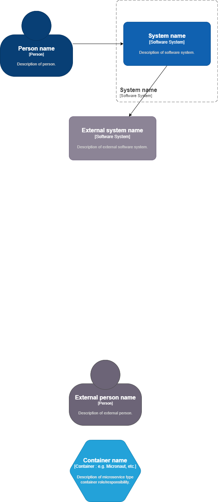

# Embedding Draw.io in markdown files

## Embedding Steps:
- open folder in VSCode
- install recommended extensions available at './.vscode/extensions.json'
- drawio png or svg files opened in drawio extension in vscode
- drawio files can be embedded in readme files & also can be edited in vscode
- Github can show png, svg files, but azure for example can only show png files

